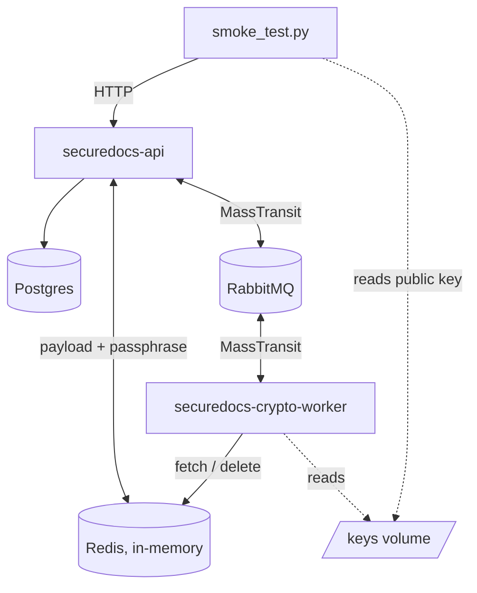

# securedocs-deploy

SecureDocs is a distributed evidence vault: users submit documents and the system returns a cryptographic proof (hash + Ed25519 signature over the hash and processing timestamp) that anyone holding the public key can verify independently, without trusting the service. The pattern fits use cases like legal document timestamping, regulatory evidence archival, or proof-of-submission systems.

This repository is the deployment orchestration: a single Compose file that runs the API, the worker, and their shared infrastructure together, plus an end-to-end smoke test that verifies the proof works across service boundaries.

---

## Table of contents

- [Related repositories](#related-repositories)
- [What this repository provides](#what-this-repository-provides)
- [Tech stack](#tech-stack)
- [Running the system](#running-the-system)
- [Configuration](#configuration)
- [Architecture](#architecture)
- [Project structure](#project-structure)
- [System flow](#system-flow)
- [Design decisions](#design-decisions)
- [Smoke test](#smoke-test)

---

## Related repositories

- [securedocs-api](https://github.com/martumucci/securedocs-api) — the HTTP API that accepts submissions and persists the proof.
- [securedocs-crypto-worker](https://github.com/martumucci/securedocs-crypto-worker) — the worker that encrypts and signs.

---

## What this repository provides

- One `compose.yaml` that brings up the full system: Postgres, Redis, RabbitMQ, the API and the worker, wired together with health-gated startup ordering.
- A smoke test that submits a document, waits for processing, retrieves the integrity proof, and verifies the Ed25519 signature independently — the only check that exercises the contract between the two independently-built services.

The per-service repositories each have their own standalone Compose file for working on that service in isolation. This repository is the only place the services run together against shared infrastructure.

---

## Tech stack

| Concern | Choice |
| --- | --- |
| Orchestration | Docker Compose |
| Infrastructure | PostgreSQL 16, Redis 7, RabbitMQ 3.13 |
| Smoke test | Python 3.12 (stdlib HTTP) + `cryptography` for signature verification |

---

## Running the system

Requires Docker. The smoke test additionally needs Python 3.12.

### From published images (default)

By default the stack pulls the API and worker images from GHCR. The packages are public, so no `docker login` is needed, and **no source checkout is required — only this repository**.

```bash
docker compose up -d
python3.12 -m venv venv
venv/bin/pip install -r requirements.txt
venv/bin/python smoke_test.py
docker compose down
```

`:latest` follows the most recent `main` build. For a reproducible run, pin an immutable tag in `.env` (copied from `.env.example`):

```bash
API_IMAGE=ghcr.io/martumucci/securedocs-api:sha-36b4254
WORKER_IMAGE=ghcr.io/martumucci/securedocs-crypto-worker:sha-b675022
```

### From local source

To build the images from the sibling source repos instead of pulling — useful when developing a service — clone `securedocs-api` and `securedocs-crypto-worker` next to this repo and run with `--build`:

```bash
docker compose up --build -d
```

If your layout differs, `cp .env.example .env` and adjust `API_PATH` / `WORKER_PATH`.

---

## Configuration

`.env` (copied from `.env.example`) is auto-loaded by Compose. Only a file named exactly `.env` is loaded; `.env.example` is documentation.

| Key | Purpose |
| --- | --- |
| `API_IMAGE` | API image to pull (default `ghcr.io/martumucci/securedocs-api:latest`) |
| `WORKER_IMAGE` | Worker image to pull (default `ghcr.io/martumucci/securedocs-crypto-worker:latest`) |
| `API_PATH` | Source build context, used only with `--build` (default `../securedocs-api`) |
| `WORKER_PATH` | Source build context, used only with `--build` (default `../securedocs-crypto-worker`) |

The smoke test reads `API_BASE_URL` (default `http://localhost:8080`) and `PUBLIC_KEY_PATH` (default `./keys/ed25519.public`).

---

## Architecture



Redis and RabbitMQ are shared by both services. Postgres is owned by the API only. The worker holds no database credentials. The Ed25519 keypair is generated by the worker on first run into a `./keys` volume shared with the smoke test.

---

## Project structure

```
compose.yaml        Full-system orchestration: 5 services, health-gated ordering.
smoke_test.py       End-to-end verification: submit -> poll -> verify signature.
requirements.txt    Smoke test dependency (cryptography).
.env.example        Documented build/image overrides.
keys/               Ed25519 keypair, generated at runtime. Never committed.
```

---

## System flow

What the smoke test exercises, end to end:

1. `POST /Documents` as `multipart/form-data` (a `File` part + a `Passphrase` field). The API stores the document bytes and passphrase in Redis and publishes `DocumentSubmitted` through MassTransit.
2. The worker consumes the event, derives the AES key from the passphrase, encrypts, hashes, signs `hash || processedAt`, and publishes `DocumentProcessed`.
3. The API consumes the result and persists the integrity bundle, transitioning the document to `Processed`.
4. `GET /Documents/{id}/integrity` returns `{ hash, signature, algorithm, processedAt }`.
5. The smoke test reconstructs `hash || canonical(processedAt)` and verifies the signature against the worker's public key.

Step 5 passing proves the cross-service contract: the MassTransit envelope format, and that the signed timestamp survives the Python → broker → .NET → Postgres → HTTP round-trip without corruption.

---

## Design decisions

### Hybrid image strategy

Each service has both an `image:` name and a `build:` section, with both driven by overridable variables. `docker compose up` pulls the published images from GHCR (the default); `docker compose up --build` builds from local source instead. The same Compose file serves registry-based deployment and local development with no edits. Building from a hardcoded sibling path alone is fragile and is not how deployments work in production; pulling versioned images from a registry is — so that is the default, with source builds available for service development.

### Shared infrastructure lives here

Redis and RabbitMQ are shared between the API and the worker. The per-service Compose files each bring up their own isolated infrastructure for working on that service alone. This repository is the single place where the services run together against one set of shared infrastructure, which is why the orchestration belongs here and not duplicated across the service repos.

### Database migrations on startup

The API applies its EF Core migrations on startup when `RunMigrationsOnStartup=true`, which this Compose file sets. The orchestrated stack needs the schema present before the API serves traffic; gating the API container on a healthy Postgres plus startup migration removes the need for a separate migration step.

### RabbitMQ uses a non-guest user

RabbitMQ restricts the default `guest` user to loopback connections. Container-to-container connections are not loopback, so the broker is configured with a dedicated user.

### Redis is in-memory only

Redis runs with no persistence (`--save "" --appendonly no`). The plain payload and the passphrase transit through Redis; keeping it memory-only ensures neither ever touches disk, consistent with the system's threat model.

### Smoke test polls the integrity endpoint

The smoke test treats the `404 → 200` transition of `/Documents/{id}/integrity` as the "processed" signal rather than parsing the document status. This decouples it from how the status enum is serialized: the existence of the proof is itself the completion signal.

### Smoke test reads the public key from the shared volume

There is no public-key endpoint yet. For a local orchestration test, reading the worker's public key PEM from the shared `keys` volume is sufficient and exposes nothing — the public key is public by design. A real client would obtain the key through a trusted channel; that is a future direction, not a smoke-test concern.

### Single worker, no pre-provisioned keypair

The smoke test runs one worker, so the worker's lazy load-or-generate of the Ed25519 keypair has no race. Pre-provisioning the keypair out of band is only required when scaling to multiple worker replicas against a shared key volume.

### Known gaps

- Worker-side idempotency against RabbitMQ redelivery is not yet implemented.

---

## Smoke test

`smoke_test.py` is the end-to-end check. With the stack up:

```bash
python3.12 -m venv venv
venv/bin/pip install -r requirements.txt
venv/bin/python smoke_test.py
```

It exits non-zero with a clear message on any failure: API not ready, document not processed in time, or — most importantly — a signature that does not verify, which would mean the proof is not independently verifiable. A passing run is the empirical confirmation that the evidence-vault guarantee holds across the full system.
